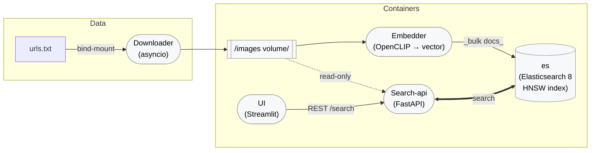

# 🖼️ Image‑Search Project

A fully Docker‑orchestrated demo that turns any list of image URLs into a local **vector‑search engine**.  It downloads pictures, embeds them with OpenCLIP, stores vectors in Elasticsearch 8, and serves a FastAPI + Streamlit front‑end so you can type a prompt such as *“red car at night”* and instantly see relevant images.

---

## 📊 Architecture at a glance



*Shared state*

* **images volume** – raw `*.jpg/.png` files (Downloader ⇄ Embedder ⇄ UI)
* **es‑data volume** – persisted Lucene shards

---

## 🔧 Prerequisites

| Tool | How to install |
|------|----------------|
| **Docker Engine ≥ 24** | • Linux: follow <https://docs.docker.com/engine/install/>.<br>  macOS: ```brew install Docker Desktop```
| **docker‑compose V2** (CLI plugin) | Install docker-compose: https://docs.docker.com/compose/ <br>  macOS: ```brew install docker-compose``` |
| **Credential helper** (pull/push without plaintext logins) | Install docker-compose: https://docs.docker.com/compose/ <br>  macOS: ```brew install docker-credential-helper```|

---

## 🚀 Quick start (local)

```bash
# 1. clone & position at repo root
$ git clone https://github.com/ayalody/image-search.git && cd image-search

# 2. create your environment file
cp .env.example .env               # edit values if you like

# 3. put some image URLs (one per line)
$ echo "https://picsum.photos/id/237/600/400" >> data/image_urls.txt

# 4. build & launch
$ docker compose build --pull
$ docker compose up --wait -d     # exits when every service is healthy

# 5. open UI
$ open "${STREAMLIT_HOST:-http://localhost:8501}"search/text
```

When the UI loads, type a phrase and you should see thumbnails in ≤ 1 second.

---

## 🔌 Endpoint reference

| URL (default ports) | Method | Served by | Description |
|---------------------|--------|-----------|-------------|
| http://localhost:8000/docs | **GET** | search‑api (FastAPI) | Interactive Swagger / OpenAPI UI. |
| http://localhost:8000/healthz | **GET** | search‑api | Returns `{ "status": "ok" }`; used by Docker health‑check. |
| http://localhost:8000/meta | **GET** | search‑api | Model name, vector dimension, document count. |
| http://localhost:8000/search/text | **POST** (JSON) | search‑api | Text prompt → top‑k images.<br>Body ⇒ `{ "query":"red car", "k":10 }`. |
| http://localhost:8000/search/image` | **POST** (multipart) | search‑api | Upload image → similar pictures. Optional form field `k`. |
| http://localhost:8501` | **GET** | ui (Streamlit) | Front‑end search page. |
| http://localhost:9200/_cat/indices?v | **GET** | es (Elasticsearch) | Cluster/index status via cat API. |

> **Tip:** Host ports are configurable in `.env` (`API_PORT`, `STREAMLIT_PORT`) or by editing the `ports:` mappings in `docker‑compose.yml`.

---